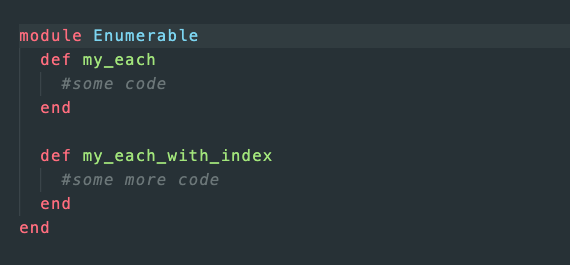

 
  
# 🧱 Advanced Building Blocks - Ruby Enumerables 

</a>

This project is part of a series of projects to be completed by students of [Microverse](https://www.microverse.org/ 'The Global School for Remote Software Developers!').

This project consists of recreating, from scratch, the Ruby [Enumerable Module](https://blog.appsignal.com/2018/05/29/ruby-magic-enumerable-and-enumerator.html) which is commonly used in day-to-day use. Due to the nature of the 'Enumerable Module' and it's oh-so frequent use - this proves to be an important concept for newcomers to Ruby.

## 📏 The Project Brief

The assignment can be found in the Odin Project's HTML and CSS course that can be found [here.](https://www.theodinproject.com/courses/ruby-programming/lessons/advanced-building-blocks)

  1. Create a new Enumerable Module.
  2. Create #my_each without using #each. Use #yield statements and ensure it does the same thing as #each.
  3. Create #my_each_with_index (still not using #each but rather #my_each now).
  4. Create #my_select.
  5. Create #my_all?
  6. Create #my_any?
  7. Create #my_none?
  8. Create #my_count
  9. Create #my_map.
  10. Create #my_inject.
  11. Test our shiny new #my_inject by creating a method called #multiply_els which (suprisingly), multiplies each array element together.
  12. Modify #my_map to take a proc instead of a block (only one at a time though).

## 🧰 Technologies & Languages Used

- Ruby 2.3.7p456
- Rubocop
- Stickler-CI
- Git Flow

## 🤯 The Project

The project can be found at https://github.com/Rhelli/Enumerable-Methods

## 💌 Contributing

Contributions, issues and feature requests are welcome! Feel free to check [issues page](https://github.com/Rhelli/Enumerable-Methods/issues).

1. Fork it (https://github.com/Rhelli/Enumerable-Methods/fork)
2. Create your working branch (git checkout -b [choose-a-name])
3. Commit your changes (git commit -am 'what this commit will fix/add/improve')
4. Push to the branch (git push origin [chosen-name])
5. Create a new Pull Request

## 👨🏾‍💻 Creator

Rory Hellier - [GitHub](https://github.com/Rhelli)

## 👍🏽 Show Your Support

Give a ⭐️ if you like this project!

